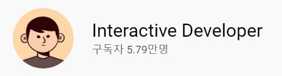
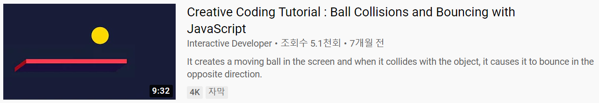

# Canvas Collision & Reflection Effect

interactive developer 님의 동영상을 따라해보는 프로젝트 그 두 번째 "충돌, 반사되는 공 만들기"

# NEW!

## IDEA

간단하게 벽돌깨기 게임을 만들어보는 것도 괜찮을 것 같다는 생각이 들었음

# Review

두 번째 canvas 체험이라, 추가적으로 무언가를 배웠다기 보다는 복습에 가까운 프로젝트. 이제 WebGl에 `Hello World!`를 외칠 수 있게된 것 같음. 다음에 공부해볼 interactive한 프로그래밍이 기대가 됨.
